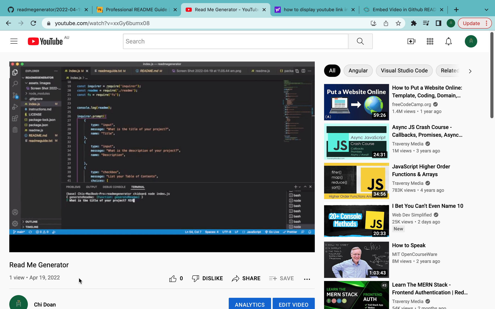

# READ ME GENERATOR

## Description
A command-line application that dynamically generates a professional README.md file from a user's input using the Inquirer package.

## Table of Contents (optional)
[Installation](##Installation),
[Usage](##Usage),
[Screenshot](#Screenshot),
[Video](#Video),
[License](#License),
[Features](#Features),
[Credits](#Credits),
[Tests](#Tests),
[Questions](#Questions),
[Copyright](#Copyright)

## Installation
First, use git clone in the terminal to download the project. Then open the project in VS Code and in the package.json folder enter the terminal. Within the terminal, use npm install inquirer to install the inquirer package. The command-line application should work when node index.js is entered in the terminal

## Usage
This application allows users to quickly and easily create a README file by using a command-line application to generate one

## Screenshot

## Video
(https://youtu.be/xxGy6bumx08 "Click Here!")

## License
MIT

## Features
NA

## Tests
NA

## Credits
NA

## Questions
Any questions email hergemony@gmail.com

## Copyright
2022 Hergemony™️ Digital Services
